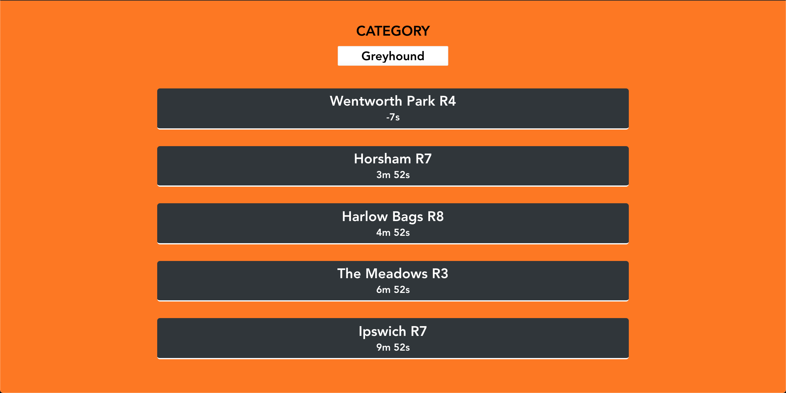

# Entain - Code Challenge for Filipe Arena

## Project setup
```
yarn install
```

### Compiles and hot-reloads for development
```
yarn serve
```
Open browser at http://localhost:8080

### To run unit tests (using Jest)
```
yarn test:unit
```

### Compiles and minifies for production
```
yarn build
```

### Lints and fixes files
```
yarn lint
```

### Customize configuration
See [Configuration Reference](https://cli.vuejs.org/config/).
